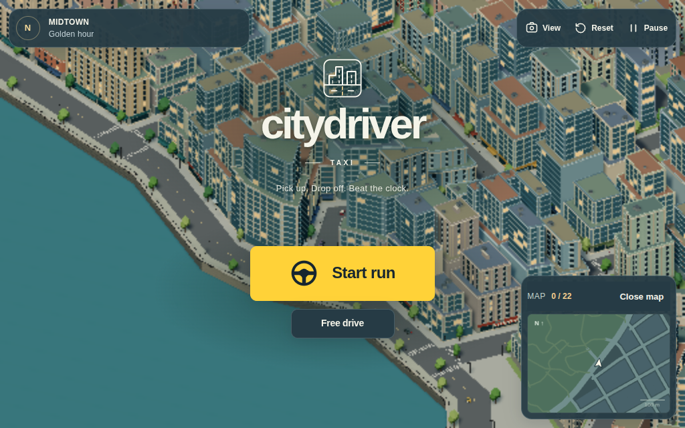
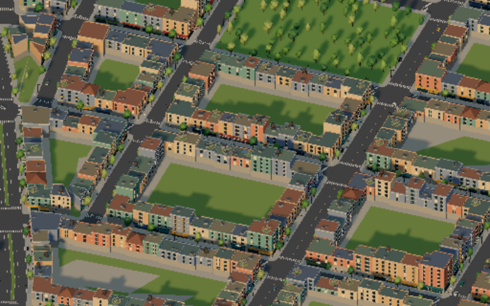
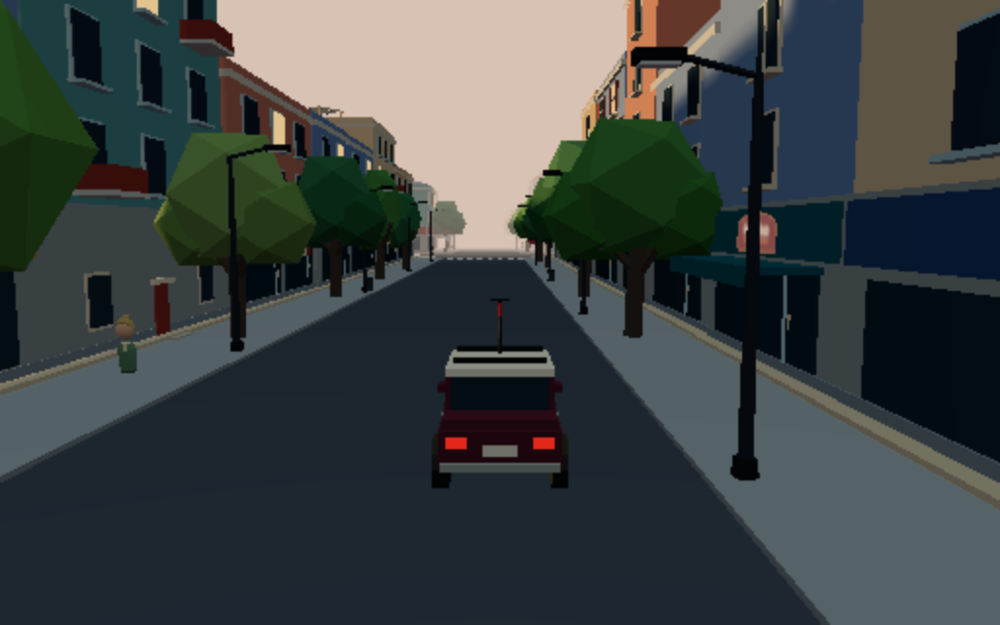
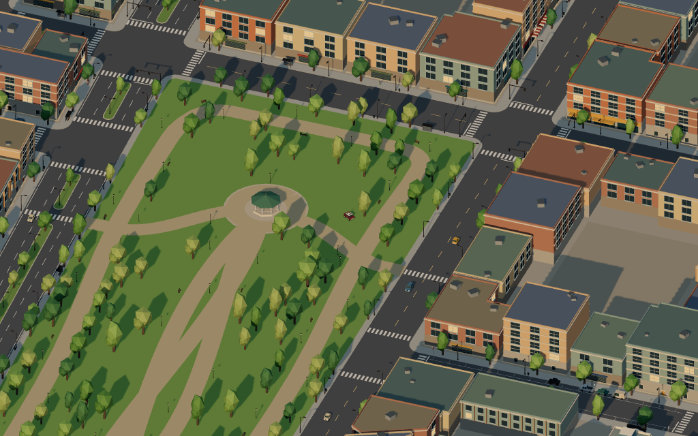
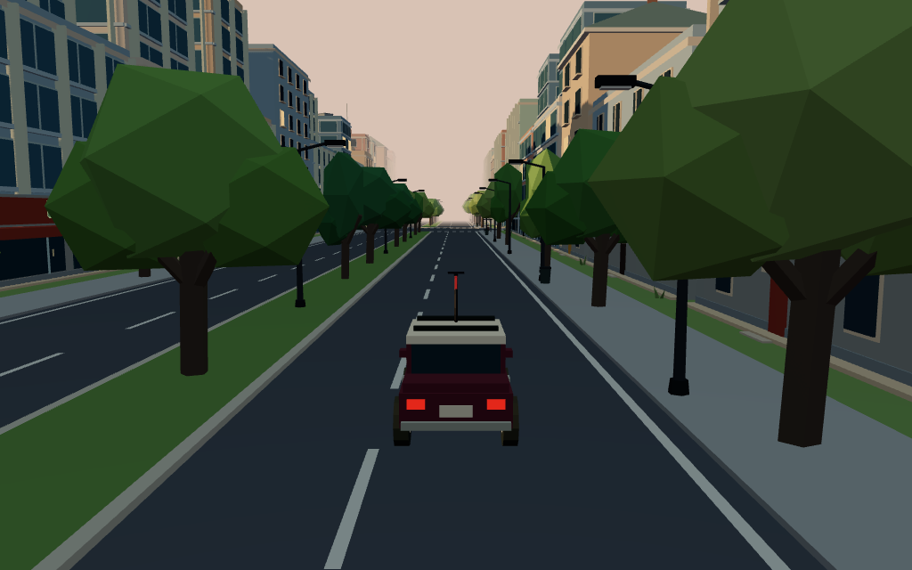

# Citydriver 2

Taxi driving game built with [Three.js](https://threejs.org/). Uses a port of [MapGenerator](https://github.com/ProbableTrain/MapGenerator) to generate a new island city every time the game loads.

Visit the [GitHub Pages site](https://jarvisar.github.io/citydriver2/) to access the latest deployment. Desktop builds for Windows, Linux and macOS are available under [Releases](https://github.com/jarvisar/citydriver2/releases).

This is the sequel to [Citydriver](https://github.com/jarvisar/citydriver). The endless grid from the first game is replaced by a generated city. The driving, cars, garage, weather, audio and taxi mode carry over from Citydriver.



## Features

- Island city with a harbour, a river, parks, boulevards and a ring road
- Six districts: Old town, Garden quarter, Warehouse district, Market district, Civic quarter and Midtown
- Buildings shaped to fit their lots
- Traffic that follows signals, stop signs and give-way signs
- Landmarks and shops that passengers can ask to go to
- Taxi mode with group fares, shift goals, driver ranks and cabs to buy
- Weather and night driving
- Keyboard, controller and touch screen support
- Can be installed and played offline

## How to Play

Start a **Taxi run** to pick up passengers and earn money. Stop in a pickup ring, follow the arrow, then stop in the yellow drop-off ring before the fare clock runs out. Earnings can be spent on faster cabs in the taxi fleet. See [progression and balance](docs/taxi-progression.md) and [taxi fleet](docs/taxi-fleet.md) for more details.

**Free drive** has no timer. All three taxis are available in the garage, and weather settings and city discoveries are in the pause menu. Press forward on the main menu to enter free drive, or press R to generate a new city.

Every visit generates a new city. Add `?seed=4817` to the URL to load the same city again.

## Controls

| Action | Keyboard | Controller |
| --- | --- | --- |
| Accelerate | W / Up | RT / R2 or A / Cross |
| Brake / reverse | S / Down | LT / L2 or B / Circle |
| Steer | A D / Left Right | Left stick |
| Boost | Shift | RB / R1 |
| Drift / handbrake | Space | LB / L1 |
| Camera | V | X / Square |
| Pause | P / Escape | Start / Menu |
| Reset | R | Y / Triangle |
| Garage / Taxi fleet | C / G | L3 |
| Autodrive (free drive) | H | D-pad Up |
| Fullscreen | F | D-pad Down (while driving) |
| Sound | Pause menu | Pause menu |
| City map | M, or Full map on the street map | View / Share |
| Street map (show / hide) | Its Hide button | |
| Menus | Tab, Enter | D-pad or left stick to choose, A / Cross to select, B / Circle to go back |

On touch screens, use the stick to drive, hold Boost, and tap Drift while steering in chase view. Release the stick to stop.

## Local Installation

Requires [Node.js](https://nodejs.org/) 22.12 or newer.

To install and run this app on a local machine, follow these steps:

1. Clone the repository:

   `git clone https://github.com/jarvisar/citydriver2.git`

2. Navigate to the project directory:

   `cd citydriver2`

3. Install the dependencies:

   `npm install`

4. Start the dev server:

   `npm run dev`

5. Open `http://localhost:5173` in a web browser.

Run `npm run build` for a production build. See [ELECTRON.md](ELECTRON.md) for the desktop app and [PWA.md](PWA.md) for offline installation.

## Tests

```sh
npm test
npm run test:smoke
```

`npm test` runs the unit tests for the city generator, navigation, handling, audio, garage and taxi rules. It builds the city for seed 4817. Set `TEST_WORLD_SEED` to test a different city.

`npm run test:smoke` drives through the city in a headless browser and reports any console errors. Start the dev server first. Set `CHROME_PATH` to use a different Chrome.

To draw a city as an SVG map, run `npm run city:svg -- 4817 city.svg`.

## Deployment

Pushes to `main` are tested and deployed to GitHub Pages by GitHub Actions, using `/citydriver2/` as the base path. When setting up a fork, go to **Settings → Pages** and set **Source** to **GitHub Actions**.

## Documentation

- [City generation](docs/city-generation.md)
- [Map generator changes](src/mapgen/README.md)
- [Handling](docs/handling.md)
- [Taxi progression](docs/taxi-progression.md)
- [Taxi fleet](docs/taxi-fleet.md)
- [Driving HUD](docs/driving-hud.md)
- [UI styles](docs/ui-style.md)
- [Audio](docs/audio.md)
- [Performance](docs/performance.md)

## Screenshots

| Blocks from above | Street |
| --- | --- |
|  |  |

| Park | Boulevard |
| --- | --- |
|  |  |

## License

The map generator in `src/mapgen/` is a port of MapGenerator by ProbableTrain and is licensed under the GNU Lesser General Public License v3.0. See `src/mapgen/COPYING.LESSER`.
