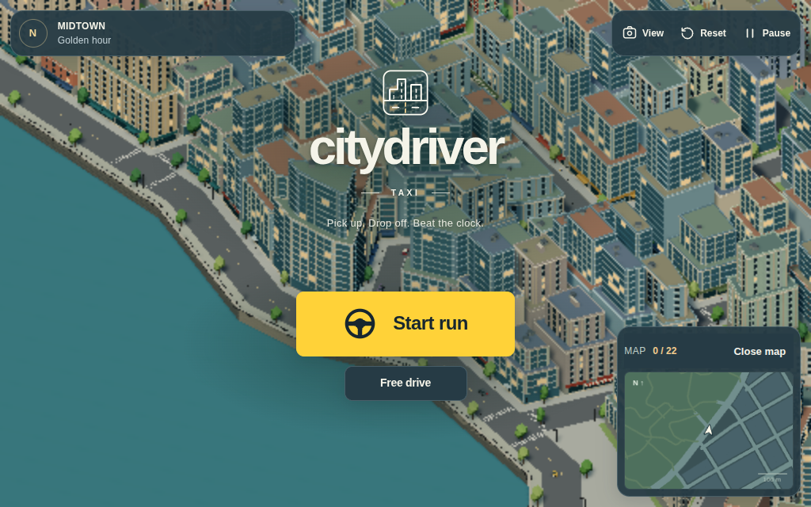
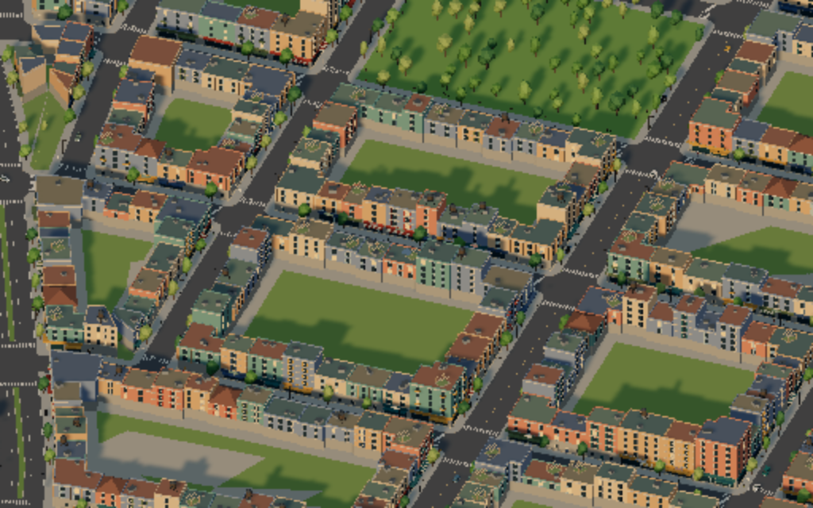
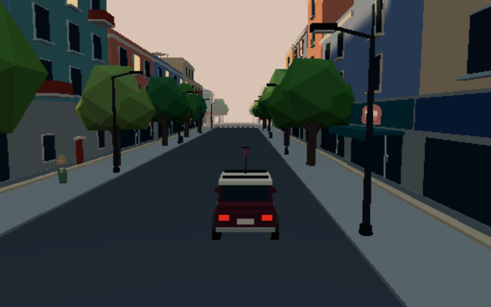
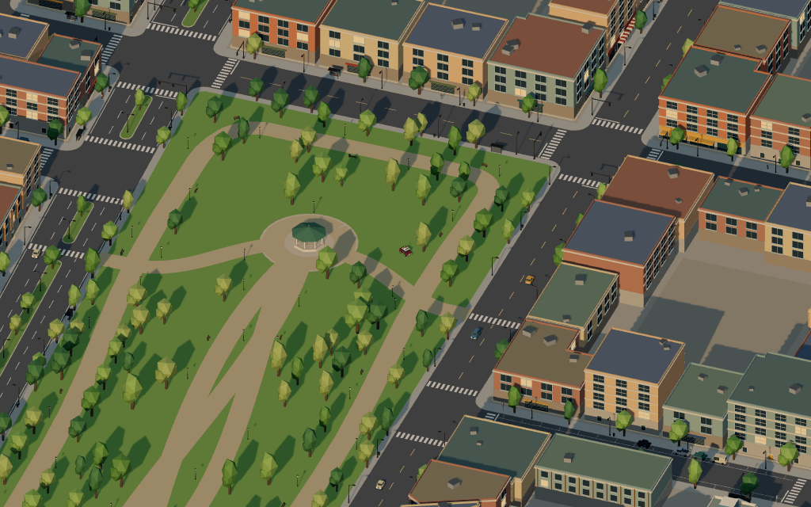
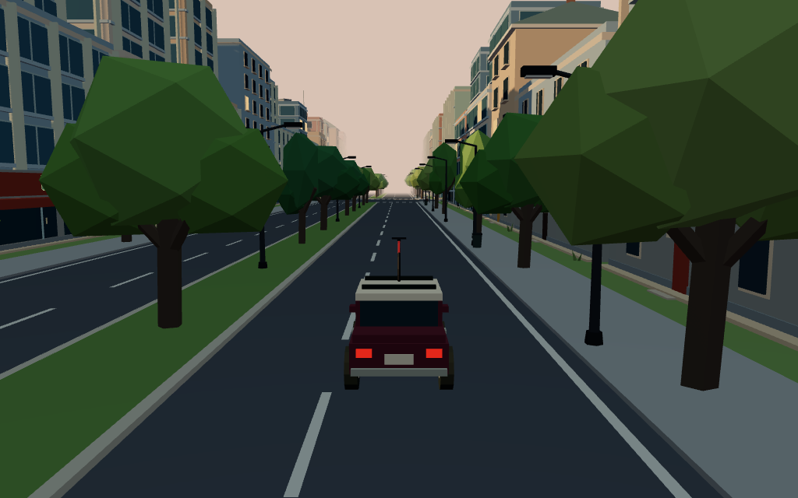

# Citydriver 2

Taxi driving game built with [Three.js](https://threejs.org/). Uses a port of [MapGenerator](https://github.com/ProbableTrain/MapGenerator) to generate a new island city every time the game loads.

Visit the [GitHub Pages site](https://citydriver2.jarvisar.com/) to access the latest deployment. Desktop builds for Windows, Linux and macOS are available under [Releases](https://github.com/jarvisar/citydriver2/releases).

This is the sequel to [Citydriver](https://github.com/jarvisar/citydriver). The endless grid from the first game is replaced by a generated city. The driving, cars, garage, weather, audio and taxi mode carry over from Citydriver.



## Features

- Island city with a harbour, a river, parks, boulevards and a ring road
- Six districts: Old town, Garden quarter, Warehouse district, Market district, Civic quarter and Midtown
- Buildings shaped to fit their lots
- Traffic that follows signals, stop signs and give-way signs
- Traffic that changes lanes on the boulevards and drives around crashed and stopped cars
- A bus that comes by now and then and stops at the bus shelters to let people on and off
- Mario Kart style drifting with a drift boost that charges in three stages
- Ramps and jumps, including a half-built bridge to jump the river
- Landmarks and shops that passengers can ask to go to
- Taxi mode with group fares, shift goals, driver ranks and cabs to buy
- Start a shift from any street in your cab
- One balance for every mode, spent on the garage's cars, specials and aircraft, with a test drive of each
- Demolition mode with a truck, damage chains, contracts, ratings and high scores
- Get out and walk around in free drive, chase pigeons and borrow cars from traffic
- Weather and night driving
- Keyboard, controller and touch screen support
- VR headsets such as Meta Quest, through WebXR
- Can be installed and played offline

## How to Play

Choose Taxi shift to drive your cab into the city. Passengers wait in rings all around it, and the shift starts when you stop in one to pick them up. Then follow the arrow and stop in the yellow drop-off zone before the fare clock runs out. Buildings have a short zone outside the entrance. Parks and squares let passengers out anywhere along their side of the street. Some passengers are in a hurry, want stunts or are nervous. An icon on their ring shows which. Drifts, jumps and near misses earn tips. If time runs out with passengers aboard, the shift ends after the last one gets out. End shift in the pause menu ends it early. Earnings go into one balance that buys faster cabs and everything else in the garage. See [progression and balance](docs/taxi-progression.md) and [taxi fleet](docs/taxi-fleet.md) for more details.

Demolition puts you in the orange demolition truck with one minute to cause as much property damage as possible. The clock starts with the first thing you hit. Lamp posts, benches, signs, trees, bus shelters and cars all have a price, and cars in traffic are worth the most. Hits in quick succession build a chain. Every fourth hit raises the chain's multiplier, up to ×5, and the chain's damage is added to the total when it ends. Each run has three contracts, like felling five trees, and each one finished adds 10 seconds to the clock. Wrecking a moving car adds 3. A jump doesn't break the chain, and landing on a car does a lot of damage. If time runs out mid-chain, the chain keeps going until it ends. Pedestrians dive out of the way if you give them the chance. Running one over costs a $10,000 fine and the chain in progress. Each run gets a rating, and the best five runs are kept as high scores. See [demolition](docs/demolition.md) for the prices, contracts and ratings.

Free drive has no timer. You start with the Surf Wagon for free drive and the Taxi for shifts, and the garage sells everything else: more cabs, ordinary cars, specials like the monster truck and the city bus, a helicopter and a plane for seeing the city from the air, and a jetpack for getting about on foot. Pick a car you don't own to buy it or test drive it for two minutes. The first test drive of each one is free. Weather settings and the places you've found are in the pause menu. Driving past a landmark or dropping a passenger at one marks it as found, and found places show up on the city map. Press forward on the main menu to enter free drive.

The modes all happen in the same city. In a cab you own, passengers wait around you in free drive too, so stopping in a ring starts a shift wherever you are. Cabs and the demolition truck also come by in the traffic now and then, and the street map shows where they are. Get out and take one to start its job on the spot: a cab has passengers waiting around it, and the truck's run starts with the first thing it hits. While you work as a cab the other cabs stay off the road, and the same goes for the truck. In a shift or a run, press E twice to end it and get out. When a shift or a demolition run ends, Free drive carries on from the same spot in the same vehicle. In free drive, drifts, jumps, near misses, smashes and flying stunts chain together like demolition hits, and when the chain runs out it's paid into your fleet balance. Crashing or running someone over loses it. New places and jump stars pay too, and so does demolition, so everything counts toward the next car and the next driver rank. See [money and the garage](docs/economy.md) for what each mode pays and what things cost.

R puts the car back on the road. New city is in the pause menu, and it has to be pressed twice since the places you've found and your jump stars are only kept for the current city.

Hold Space and steer to drift. The car hops and then slides round the corner until you let go. Steer into the corner to tighten the drift or away from it to widen it, and brake to tighten it more. Keep drifting and the sparks at the back wheels turn blue, then orange, then pink. Let go to get a speed boost, bigger for each colour. Steering hard into the drift charges it faster. Crashing or slowing right down loses the charge. Below about 18 mph, Space is a handbrake.

There are jumps around the city. Loading ramps sit in parking spaces in the Warehouse district, parks have dirt mounds, and a half-built bridge reaches out over the river. The river jump needs a fast car and a long run up. Fall short and you're put back at the start of the run up. In a run that also costs 5 seconds. In the air, steer to turn the nose. Press Space just as you leave a ramp to do a trick, or press and hold Space and steer to spin. Land a trick or a spin and you get a boost like a drift's. Land roughly straight or the car spins out. You can also land on other cars. The ramps and the river jump get up to three stars for distance, and the pause menu lists them with your best for the current city. They're marked on both maps.

In free drive, press E to get out of the car and walk around. Press E near your car, a car in traffic or a car parked along the street to get in. A marker shows which car. If it's a few metres away you walk over to it on your own, and a car in traffic stops to wait for you. Moving the stick or pressing a movement key cancels it. A car taken from traffic drives off on its own when you get out. A parked car stays where you leave it and goes back to its space once you are far away. Your own car stays where you left it and is marked on both maps. Picking a car in the garage puts you in it. If the car is still going fast, press E a second time to jump out while it slows down.

The helicopter and the plane land by themselves when you press E, and you get out once they're down. Any flying control takes over again. Press E a second time while you're still up high to jump out, and the empty helicopter or plane lands on its own nearby. If you get out on a roof you can walk around up there and step off the edge.

The plane needs a run up. Hold W and it takes off at about 25 m/s, or sooner if you hold Space. Once it's up it cruises by itself and holds its height. W and S speed it up and slow it down, A and D bank it into a turn, and Space and Shift pull up and dive. Near the ground it levels out on its own, so holding Shift sets it down on a street, a park or a big flat roof. Neither aircraft can land on the water, but both can fly low along the river and under the bridges. Double-tap A or D in the plane to barrel roll, and Space to loop the loop. Landmarks you fly close to count as found, the same as on foot.

Tap Space to hop, and press it again in the air to flip. Once you have the jetpack from the garage, hold Space to fly with it, and let go to drop. Hold Shift to fly faster. Up high, tap Space to open your parachute and tap it again to put it away. Steer the parachute with the movement keys. On foot, landmarks count as found from anywhere near them, including inside parks and squares. Pigeons gather around some of the benches and scatter if you run at them or drive past fast.

In first-person view on foot, A and D turn you. Once you click the view to look around with the mouse, A and D step sideways instead, like the left stick on a controller.

Every visit generates a new city. Add `?seed=4817` to the URL to load the same city again.

## Controls

The controller layout is the one most driving games use (Need for Speed Heat, Burnout Paradise, GTA V): the triggers drive, A boosts, X drifts and Y gets in and out. The shoulder buttons do what Space and Shift do on a keyboard, so LB drifts, climbs and jumps, and RB boosts, descends and sprints.

| Action | Keyboard | Controller |
| --- | --- | --- |
| Accelerate | W / Up | RT / R2 |
| Brake / reverse | S / Down | LT / L2 |
| Steer | A D / Left Right | Left stick |
| Boost | Shift | A / Cross, or RB / R1 |
| Drift (hold and steer), handbrake when slow | Space | X / Square, or LB / L1 |
| Trick / spin (in the air) | Space as you take off / hold Space and steer | X / Square as you take off / hold X / Square and steer |
| Climb / descend (helicopter, plane) | Space / Shift | Right stick, or LB / L1 and RB / R1 |
| Barrel roll / loop (plane) | Double-tap A or D / double-tap Space | Flick the left stick twice / double-tap LB / L1 |
| Camera | V | B / Circle |
| Pause | P / Escape (Escape also frees the mouse) | Start / Menu |
| Reset car (−5 seconds in a run) | R | D-pad Down |
| Garage (cars, cabs and liveries) | C / G | Pause menu |
| Autodrive (free drive) | H | D-pad Up |
| Get out / get in (free drive), end a shift or run (press twice) | E, then E again to jump out | Y / Triangle, then again to jump out |
| Walk (on foot) | W A S D / arrows | Left stick |
| Sprint (on foot) | Shift | RT / R2 or RB / R1 |
| Jump / jetpack (hold) / parachute (tap up high) (on foot) | Space | A / Cross or LB / L1 |
| Fullscreen | F, or Fullscreen in the pause menu | Fullscreen in the pause menu |
| Look around (chase and first-person view) | Mouse, after a click on the view (at once in fullscreen) | Right stick (sideways only when flying) |
| Camera distance (third and first person) | Mouse wheel or [ / ] | D-pad left / right |
| Recenter camera | Q | R3 / right stick click |
| Sound | Pause menu | Pause menu |
| City map | M, or City map on the street map | View / Share |
| Street map (show / hide) | N, or its arrow button | |
| Menus | Tab, Enter | D-pad or left stick to choose, A / Cross to select, B / Circle to go back |

On touch screens, drag anywhere with one thumb to drive and use Boost and Drift at the bottom right with the other. Hold Drift while steering to drift in chase view. The Drift button shows the spark colour and a bar that fills toward the next one. Press and hold Drift in the air and steer to spin. Release the stick to stop. In first or third person, keep one thumb on the stick and drag a second thumb across the scene to look around. In the helicopter and the plane, hold Climb or Descend. On foot, drag the stick the way to walk and push it further to run. Tap Jump to hop or hold it to fly, hold Sprint, and tap Get out or Get in.

Zoom all the way in to enter first person. Zoom out to return to a close third-person view. This works while driving or walking, with the mouse wheel, [ / ], D-pad left / right or the tablet camera buttons.

V or B / Circle cycles through Far, Close, Third person and First person.

On tablets, the camera buttons under the pause button zoom and recenter the view. Phones leave them out to keep the screen clear, and the camera recenters by itself after you look around. On phones the reset button only shows up in a run, after the car has been stopped for a few seconds. Pause → Display → Camera has view, distance, sensitivity and vertical inversion settings. Mouse, touch and controller each keep their own look settings; driving and walking remember separate views and distances. Recenter keeps the chosen distance. F3 toggles the FPS counter.

If holding Drift gets tiring, turn on Tap to drift in the pause menu. Then one tap starts holding the button and the next one lets go. Controllers, VR controllers and Android phones vibrate for drift sparks, boosts, crashes and hard landings. Vibration in the pause menu turns it off.

### VR

In a headset's browser, such as the Meta Quest Browser, select `Enter VR` on the main menu or the pause menu. VR starts on a menu with the car standing still. Menus open in front of the player and the HUD sits below the car. Point at a menu with either controller and pull the trigger, or use a thumbstick and A.

| Action | Quest controllers |
| --- | --- |
| Accelerate | Right trigger |
| Brake / reverse | Left trigger |
| Steer | Left thumbstick |
| Boost | Right grip |
| Drift (hold and steer), handbrake when slow | Left grip |
| Trick / spin (in the air) | Left grip as you take off / hold left grip and steer |
| Climb / descend (helicopter, plane) | Right thumbstick, or left and right grip |
| Get out / get in (free drive) | Y |
| Walk (on foot) | Left thumbstick |
| Jump / jetpack (hold) / sprint (on foot) | Left grip / right grip or right trigger |
| Look around | Right thumbstick (left and right) |
| Camera | A |
| Pause | B or left thumbstick click, and Y in a run |
| Reset car | X |
| Recenter view | Right thumbstick click |
| Menus | Point and pull the trigger, or a thumbstick to choose and A / X to select. B / Y to go back |

The pause menu has a comfort vignette that darkens the edges of the view in sharp turns. It is on by default. VR needs an HTTPS page. See [VR](docs/vr.md) for more details.

## Local Installation

Requires [Node.js](https://nodejs.org/) 22.12 or newer.

To install and run this app on a local machine, follow these steps:

1. Clone the repository:

   `git clone https://github.com/jarvisar/citydriver2.git`

2. Navigate to the project directory:

   `cd citydriver2`

3. Install the dependencies:

   `npm install`

4. Start the dev server:

   `npm run dev`

5. Open `http://localhost:5173` in a web browser.

Run `npm run build` for a production build. See [ELECTRON.md](ELECTRON.md) for the desktop app and [PWA.md](PWA.md) for offline installation.

## Tests

```sh
npm test
npm run test:smoke
```

`npm test` runs the unit tests for the city generator, navigation, handling, audio, garage, taxi and demolition rules. It builds the city for seed 4817. Set `TEST_WORLD_SEED` to test a different city.

`npm run test:smoke` drives through the city in a headless browser and reports any console errors. Start the dev server first. Set `CHROME_PATH` to use a different Chrome.

To draw a city as an SVG map, run `npm run city:svg -- 4817 city.svg`.

To try VR without a headset, add `?xr` to the dev server's URL. This emulates a Meta Quest 3 in the browser. `node scripts/vr-review.mjs` enters VR this way, steps through every headset menu and saves screenshots to `.artifacts/vr-review`.

## Deployment

Pushes to `main` are tested and deployed to GitHub Pages at `citydriver2.jarvisar.com` by GitHub Actions, served from the root. A fork served from `<user>.github.io/citydriver2/` needs `--base=/citydriver2/` added to the build step in `main.yml`. When setting up a fork, open the repository's Pages settings and set `Source` to `GitHub Actions`.

## Documentation

- [City generation](docs/city-generation.md)
- [Map generator changes](src/mapgen/README.md)
- [Handling](docs/handling.md)
- [Taxi progression](docs/taxi-progression.md)
- [Taxi fleet](docs/taxi-fleet.md)
- [Money and the garage](docs/economy.md)
- [Demolition](docs/demolition.md)
- [Driving HUD](docs/driving-hud.md)
- [UI styles](docs/ui-style.md)
- [VR](docs/vr.md)
- [Audio](docs/audio.md)
- [Performance](docs/performance.md)

## Screenshots

| Blocks from above | Street |
| --- | --- |
|  |  |

| Park | Boulevard |
| --- | --- |
|  |  |

## License

The map generator in `src/mapgen/` is a port of MapGenerator by ProbableTrain and is licensed under the GNU Lesser General Public License v3.0. See `src/mapgen/COPYING.LESSER`.

The Oswald font in `src/fonts/` is by The Oswald Project Authors and is licensed under the SIL Open Font License 1.1. See `src/fonts/OFL.txt`.
